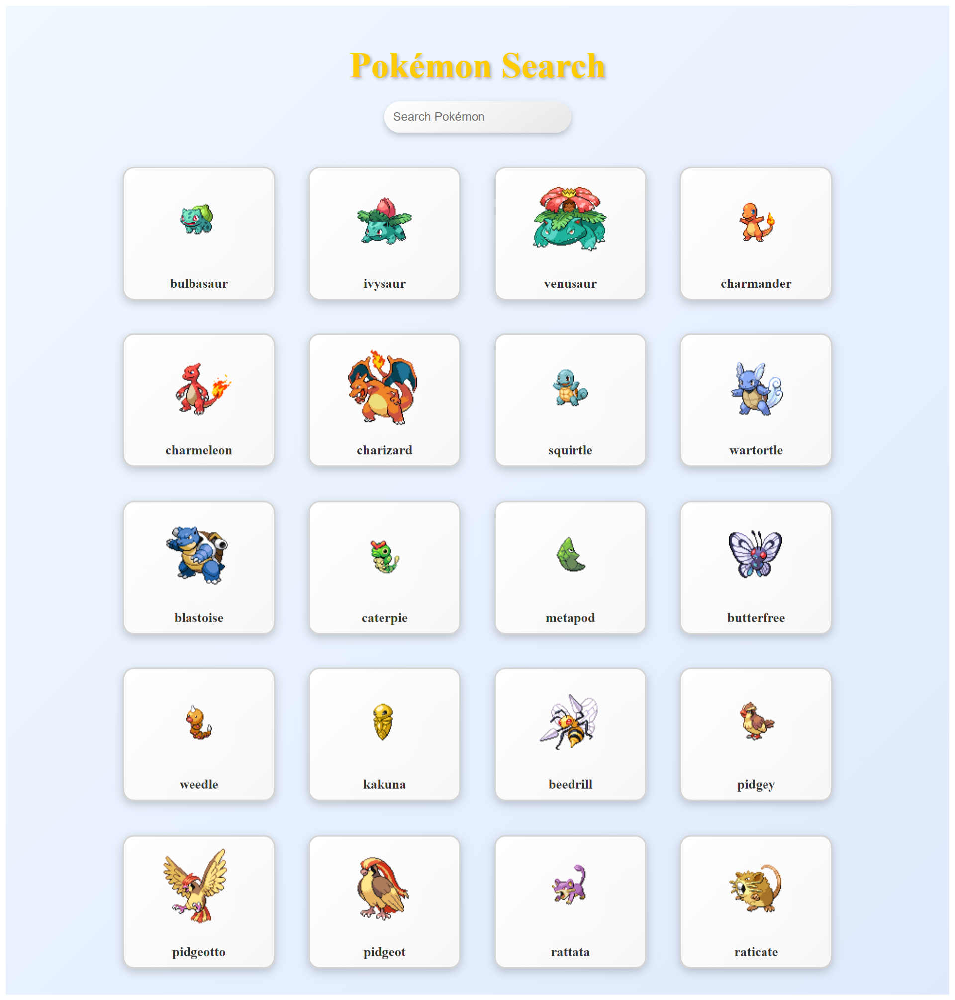

<h2 align="center">Pokémon Search Page</h2>
<p align="center">
An Exciting Web Application powered by the PokeAPI to fetch Pokémon Data.
</p>

## Project Overview

This web application fetches Pokémon data and displays it in a visually appealing and interactive format. It includes features such as searching for Pokémon, viewing detailed information, and enjoying a vibrant UI.

Visit the deployed page at [Pokémon Search Page](https://pokeapi-integration.vercel.app/) to see the live application in action.
For the code, visit GitHub at [Pokémon Search Page](https://github.com/kvskmurty2802/PokeAPI-Integration/).



## Table of Contents

- [Features](#features)
- [Installation](#installation)
- [Contributing](#contributing)
- [Top Contributed Repositories](#top-contributed-repositories)
- [Contact](#contact)
- [Donations](#donations)

## Features

- **Pokémon Cards:** Displays Pokémon with images and names in a colorful card format.
- **Search Functionality:** Allows users to search for Pokémon by name with real-time filtering.
- **Responsive Design:** Optimized for various screen sizes, ensuring a seamless user experience.
- **API Integration:** Utilizes the PokeAPI to fetch and display Pokémon data.

## Installation

1. Clone the repository:
   ```bash
   git clone https://github.com/kvskmurty2802/PokeAPI-Integration.git
2. Navigate into the project directory:
   ```bash
    cd PokeAPI-Integration
3. Install dependencies:
   ```bash
    npm install
4. Start the development server:
   ```bash
    npm run dev
5. Open your browser and visit below link to view the weather page.
   ```bash
    http://localhost:5173
## Contributing

Contributions are welcome! Please follow these steps:

1. Fork the repository.
   
2. Create a new branch (`git checkout -b feature/my-feature`).
   
3. Commit your changes (`git commit -am 'Add new feature'`).
   
4. Push to the branch (`git push origin feature/my-feature`).
   
5. Open a pull request.


## 🔝 Top Contributed Repositories

Here are some of my top contributed repositories:

[TheMovieDB](https://github.com/kvskmurty2802/TheMovieDB) - [](https://themoviedb-wine.vercel.app/)

[Portfolio Page](https://github.com/kvskmurty2802/Portfolio_Page) - [](https://portfolio-page-nu-two.vercel.app/)

[Weather Page](https://github.com/kvskmurty2802/Weather_Page) - [](https://weather-page-eight.vercel.app/)


Feel free to explore these projects and contributions!

## Contact

GitHub Profile: [kvskmurty2802](http://github.com/kvskmurty2802/)

Contact me via [Email](mailto:krishnamurty2802@gmail.com).


## 💰 You can help me by Donating
[](https://buymeacoffee.com/kvskmurty2802) 
[](https://www.paypal.com/paypalme/kvskmurty2802/) 
